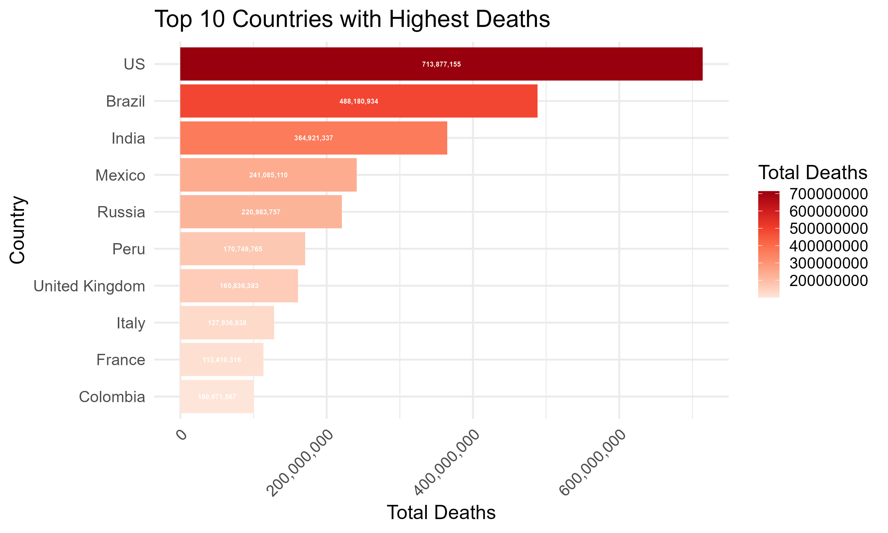

# COVID-19 Data Analysis: Global Trends, Mortality, and Recovery Rates

## 📌 Github Repository  
[GitHub Link](https://github.com/edbertocampo/COVID-19-Data-Analysis)  

---

## 1️⃣ Introduction  
The COVID-19 pandemic has significantly impacted global public health and economies, necessitating extensive data analysis to understand trends, mortality rates, and recovery patterns.  

### **Objectives:**  
- To visualize the global distribution of COVID-19 deaths.
- To identify the top 10 countries with the highest death toll.
- To analyze the temporal progression of confirmed cases and daily new cases.
- To compare recovery and death rates over time.
- To assess model performance metrics for potential predictive analysis.

---

## 2️⃣ Methodology  

### **2.1 Data Collection and Preprocessing**  
The dataset comprises global COVID-19 case counts, deaths, and recoveries. Preprocessing steps included:  
✔ **Data Cleaning**: Handling missing values.  
✔ **Standardization**: Ensuring consistency in date formats and column names.  
✔ **Aggregation**: Grouping data by country and date for analysis.  

### **2.2 Visualization Techniques**  
📌 **Geospatial Heatmap** – Distribution of COVID-19 deaths across countries.  
📌 **Bar Chart** – Highlights top 10 countries with the highest deaths.  
📌 **Line Chart** – Tracks cumulative confirmed cases over time.  
📌 **Histogram** – Visualizes fluctuations in daily new cases.  
📌 **Area Chart** – Compares recovery and death rates over time.  

---

## 3️⃣ Results and Findings  

### **3.1 Global COVID-19 Deaths Heatmap**  
- The **United States, Brazil, India, and Russia** recorded the highest death tolls.  
- Europe and South America faced **widespread mortality**.  
- African countries generally reported lower death counts, likely due to underreporting.
  

    
  
   
  

### **3.2 Top 10 Countries with Highest Deaths**  
- The **United States leads** in total deaths, followed by **Brazil, India, Mexico, and Russia**.  
- The UK, Italy, and France were among the hardest-hit European nations.
  

    
  
   

### **3.3 COVID-19 Confirmed Cases Over Time**  
- Cases surged **exponentially in early 2020** and during variant outbreaks (Delta, Omicron).  
- Growth rates **slowed in late 2022** due to widespread vaccinations and public health measures.
  

    
  
    

### **3.4 Daily New COVID-19 Cases**  
- **Multiple spikes** correspond to pandemic waves.  
- The largest surge occurred **between late 2021 and early 2022** (Omicron variant).
  

    
  
  

### **3.5 Recovery vs. Death Rate Over Time**  
- Early in the pandemic, **death rates were high** due to limited treatment options.  
- Recovery rates **improved significantly by mid-2021** with vaccines and better medical care.
  

    
  

---

## 4️⃣ Model Performance Metrics  

### **4.1 Residual Analysis of ARIMA(3,1,4)**  
- Residuals should be **randomly distributed** around zero for a well-fitted model.  
- High volatility during case surges suggests **heteroscedasticity**.

  

### **4.2 Autocorrelation Function (ACF) of Residuals**  
- Some lags (**5, 10, 15, 25**) exhibit **statistically significant autocorrelation**, indicating that the model might need further refinement. 

  

---

## 5️⃣ Interpretation and Discussion  

### **5.1 Geographic Impact**  
🌎 **Americas & Europe**: High mortality due to aging populations and healthcare strain.  
🌍 **Africa**: Lower reported cases, likely due to **underreporting** and **limited testing**.  
🌏 **Asia**: Varied response, with **China, South Korea, and Taiwan** successfully containing outbreaks, while **India** faced massive surges.  

### **5.2 Wave Patterns and Variants**  
- **First Wave (2020)**: High mortality, strict lockdowns.  
- **Second & Third Waves (2021)**: Variants (Alpha, Beta, Delta) led to **higher hospitalizations**.  
- **Omicron (Late 2021 – 2022)**: Highly transmissible but **less severe** due to widespread immunity.  

### **5.3 Healthcare System Response**  
🏥 **Hospital Preparedness**: ICU expansion helped manage cases, but some countries **faced overloads**.  
💉 **Vaccine Rollout**: **mRNA (Pfizer, Moderna)** and **vector-based (AstraZeneca, J&J)** vaccines reduced severe cases.  
⚠ **Vaccine Inequity**: Low-income nations struggled with **access** and **distribution challenges**.  

### **5.4 Predictive Modeling Implications**  
✔ **Real-time data** should be integrated into forecasting models.  
✔ **Machine Learning models (LSTM, Random Forests)** can enhance accuracy.  
✔ **Early warning systems** can help **anticipate new outbreaks**.  

---
## 🔗 Contributors  
👨‍💻 **Edbert Ocampo** – [GitHub Profile](https://github.com/edbertocampo)  

